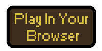
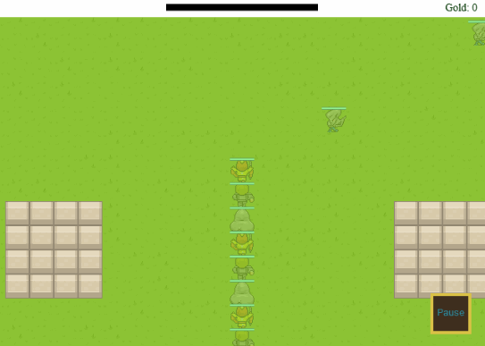
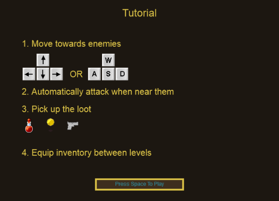

# Chain Of Heroes [Action RPG] [Snake] [Browser Game]

# About the Game

Chain of Heroes combines Snake with Action RPG elements!

Play as a group of fugitives trying to find your way off a hostile planet.

Carefully navigate your heroes between enemy hordes to attack but avoid running into them, yourselves or the walls! 

**I appreciate any and all feedback. How can I make the game more fun?**

# TODOs

1. More skill gems and weapons
1. A World Map ala Super Meat Boy
1. Better graphics
1. Sound and music
1. A concept of elements.  That is, bad guys who are weak against fire but strong against ice. Then you'll equip skill gems to change the element of your attacks.
1. More effort on game balance

# Story

The graphics give no indication of the game's theme, but here's my idea for the story:  

You're serving time in a futuristic prison in space.  Without warning, a meteorite smashes into the prison's electric grid, allowing you to raid the armory as you escape.  The only catch is you're shackled to a bunch of other people so you have to work as a team to survive on the hostile planet.    

# About Me

I've been working on this game for over a year as a hobby project for at least 30 minutes a day. As you can see, I'm not much of an artist and I haven't added any sound or music yet.  I've never finished a game before.  This is my second attempt! All the assets are placeholder art and you can find the licenses in the HTML source of the game.
